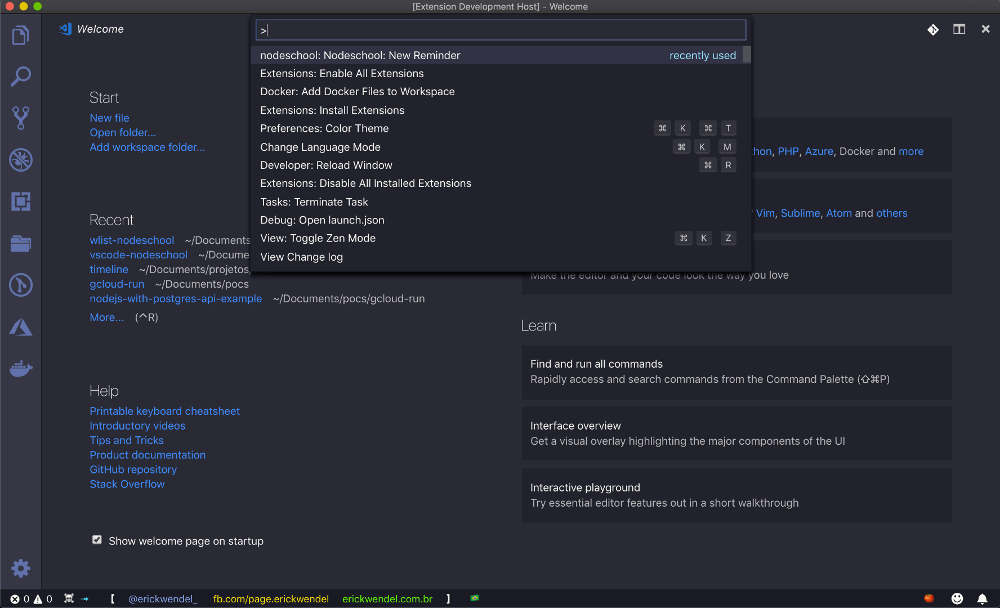

# wlist-nodeschool

- SFNodeschool demos: "How to create a VSCode extension"
- Access [our workshop notes](workshop.txt) to see the step by step

## Demo

- Running this your could create reminders and the VSCode will alert you (with text and sound). See the demo below

## Author

- [@erickwendel](https://erickwendel.com/)